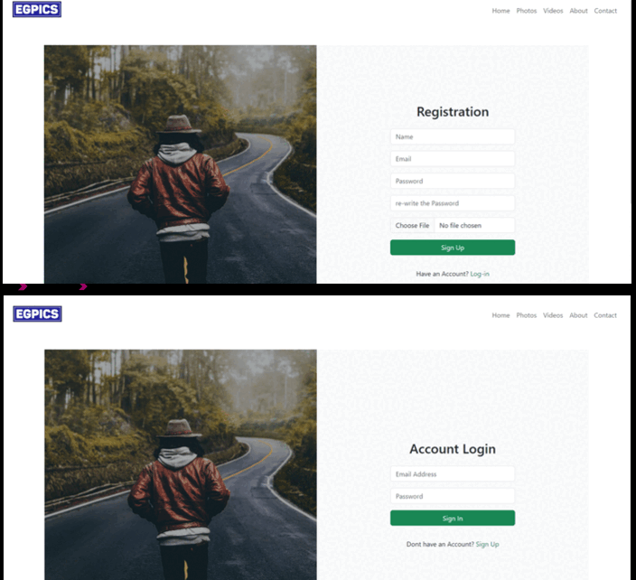

# EgPics 📸🎥  
EgPics is an innovative platform designed for photographers and videographers to share, showcase, and interact with creative works. Built with **Laravel (PHP)**, **MySQL**, **HTML**, **CSS**, and **Bootstrap**, it combines technical depth with user-centered design to foster a supportive and engaging creative community.

## Features 🚀  
- **Multi-Auth**: Secure user and admin roles.  
- **Media Uploads**: Intelligent media type detection (images/videos).  
- **Video Thumbnails**: Auto-generated for fast loading.  
- **Social Interaction**: Likes and comments for engagement.  
- **Content Categorization**: Organized browsing with tags and categories.  
- **Admin Controls**: Banner management, content moderation, and user status updates.  
- **Dashboard Overview**: Track activity, media stats, and active users.

---

## Demo Video 🎥  
Experience EgPics in action:  

For the full demo, watch the video here: [EgPics Video](https://drive.google.com/file/d/178wh0jw8Kwmyr83Lnrc9_4G6j2v9tJls/view?usp=sharing)

---

## Acknowledgment 🙌  
Developed in collaboration with **[Hussien Elgendy](https://github.com/HussienElgendy9)**.  
